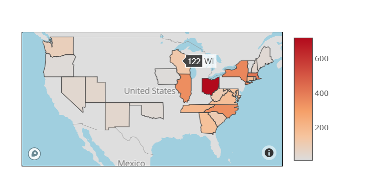
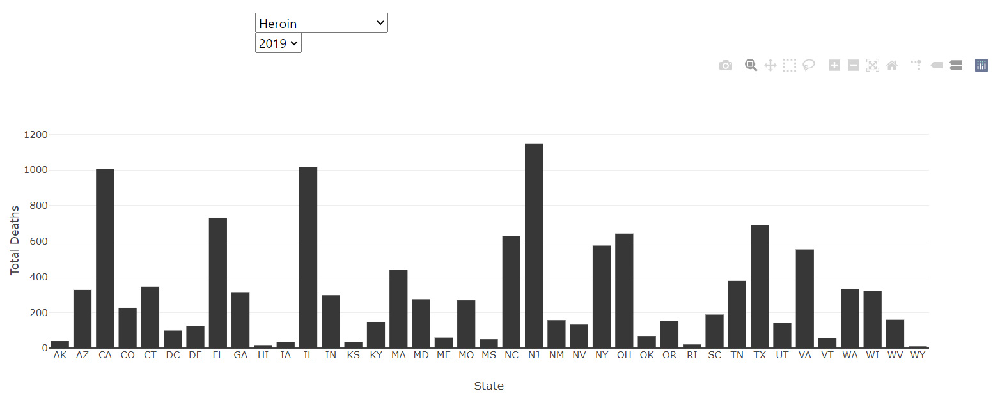
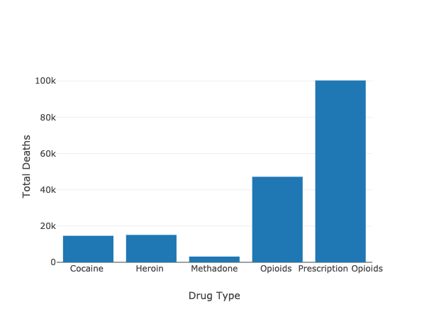

# Drug Overdose trends in the United States

### Visualization link: 
http://drug-study.herokuapp.com/

### Language
Python| HTML | JavaScrip | Jupyter NoteBook

### Introduction
In the past 3 decades, drug overdoses have killed approximately 870,000 people. Since first wave of the opioid epidemic began in the 1990s, the epidemic has expanded to include other synthetic, illicit drugs, including heroin and fentanyl. As new CDC data and other studies offer updates on the epidemic. 

### Methodology
This repository contains analytic code, findings and charts. Specifically, this repository processes and analyzes the CDC's drug overdose death data by year, geography, and specific drug combinations.

###	What data sources we chose, and why?
The analyses in this repository use " Cause of Death" data from the Healthdata.gov, which collects mortality data by state, time, geography and drug type. 
It is a readily accessible dataset with data regarding drug overdoses across US states with the ability to download into CSV. 

This dataset is stratified by 3 key categories:
Month and Year (available from January 2016 thru December 2019)
State (Washington DC stats are also included)
Drug types (Cocaine, Heroin, Meth, Prescription Opioids, Psychostimulants)

### Center For Disease Control And Prevention (CDC)
https://healthdata.gov/dataset/vsrr-provisional-drug-overdose-death-counts
Overdose or “drug poisoning” deaths as: "deaths resulting from unintentional or intentional overdose of a drug, being given the wrong drug, taking a drug in error, or taking a drug inadvertently."

### State reporting quality
The quality of data reported by medical examiners varies by state. The CDC has noted that some states have a tendency to report drug poisoning deaths without listing a specific drug. 
The analyses below incorporate this research to identify states that have higher death rate as a result of overdose in the United States from 2016-2019. 

### Detailing the process 

* We first cleaned the data in python. Removed unwanted columns and renamed the columns.
* We created the database – drugstudy_db in postgresSQL
* We opened the Heroku app and created a drug-study page for our project - http://drug-study.herokuapp.com/
* Created the flask application to create the json api
* Created a Heroku server in postgres and generated a database
* Wrote the javascript code
* Deployed the code to heroku

We checked to see if there were null values in our drug data. There were 27,380 rows out of 34,945 rows with null data. Since we are interested in state overdose death count in relation to our data by state, we dropped all rows that contain null values in the state column. We now have 7,565 rows without null data in relation to the state column.  Since, null data was indicated in year 2015 column, we dropped 2015 column. 

We used SQL Postgres database-- a connection was made to the local database in Postgres. A table was created: “Drug_data” , data was then transferred into SQL successfully.

#### Why Postgres SQL Database?
The data type we chose for this project are all structured data and are related. In addition, joining the tables will allow us to provide meaningful insights and analyses beyond what is reflected in each individual table as demonstrated by some of the use cases outlined. 

### Why did we use Flask?

We used this application to compile modules and libraries which also helped us connect to HTML and Heroku. All libraries setup within the virtual environment were imported in flask server and specified within the requirements file. Routes to each dataset were determined, jsonified, and uploaded into the server.

### Heroku Deployment 

Heroku postgres database url was linked into the flask server in order to deploy the loaded data into our application. Heroku server was built in postgres where all the data was imported. Loaded data was limited to 10000 rows (Free Subscription Heroku Plan). This led our team to further concatenate the raw data and reduce the amount of rows imported. The remote app link was created and used to push all necessary updates and deploy our application.   

### HTML/CSS/JS (Plotly/D3)

Index page contained the home page to our application. The structure of the page was built and coded within the index page using HTML. Styling and formatting was done within CSS where the dimensions of each graph were designed. Interactive plots were built using javascript along with all the jsonified data being aggregated and represented on each graph. CSS & JS codes were linked within HTML where everything was networked together.

#### Comparison of Overdose Deaths by Year

Looking more specifically into the sample of states discussed. Prescription drug overdose rates are higher among other drug types

#### Project -2
#### Group 12
#### Prepared by Shimsy Varkey, Sam Jebreen, Justin Chow, Zhanna Kirbakayeva
### @2020
